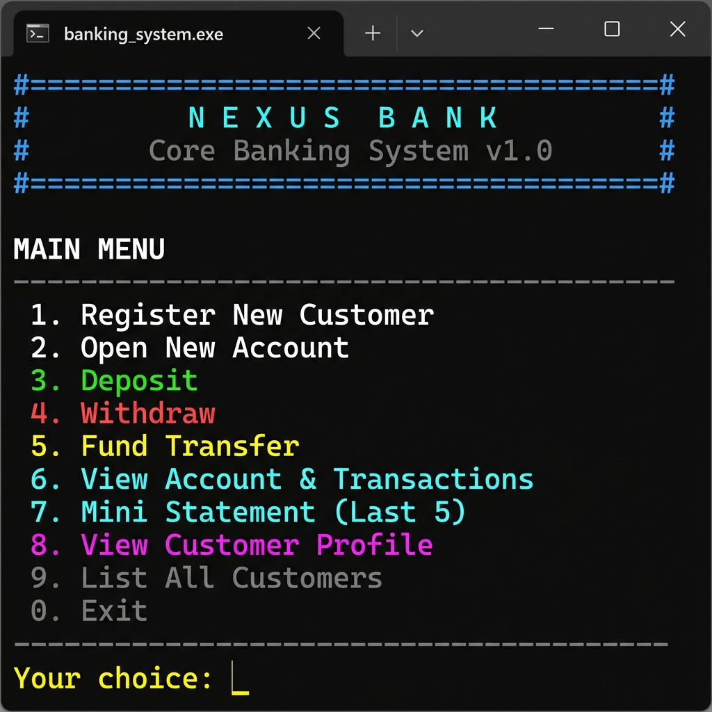
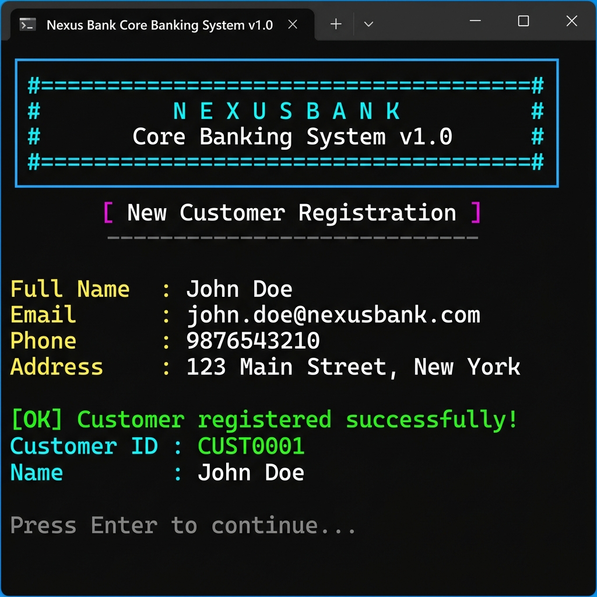
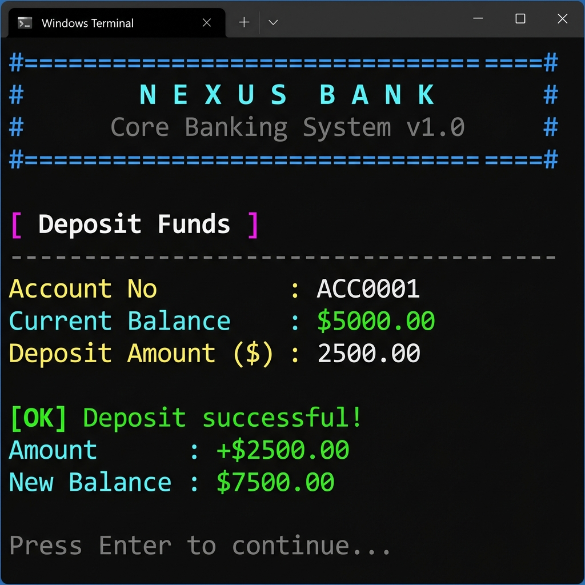
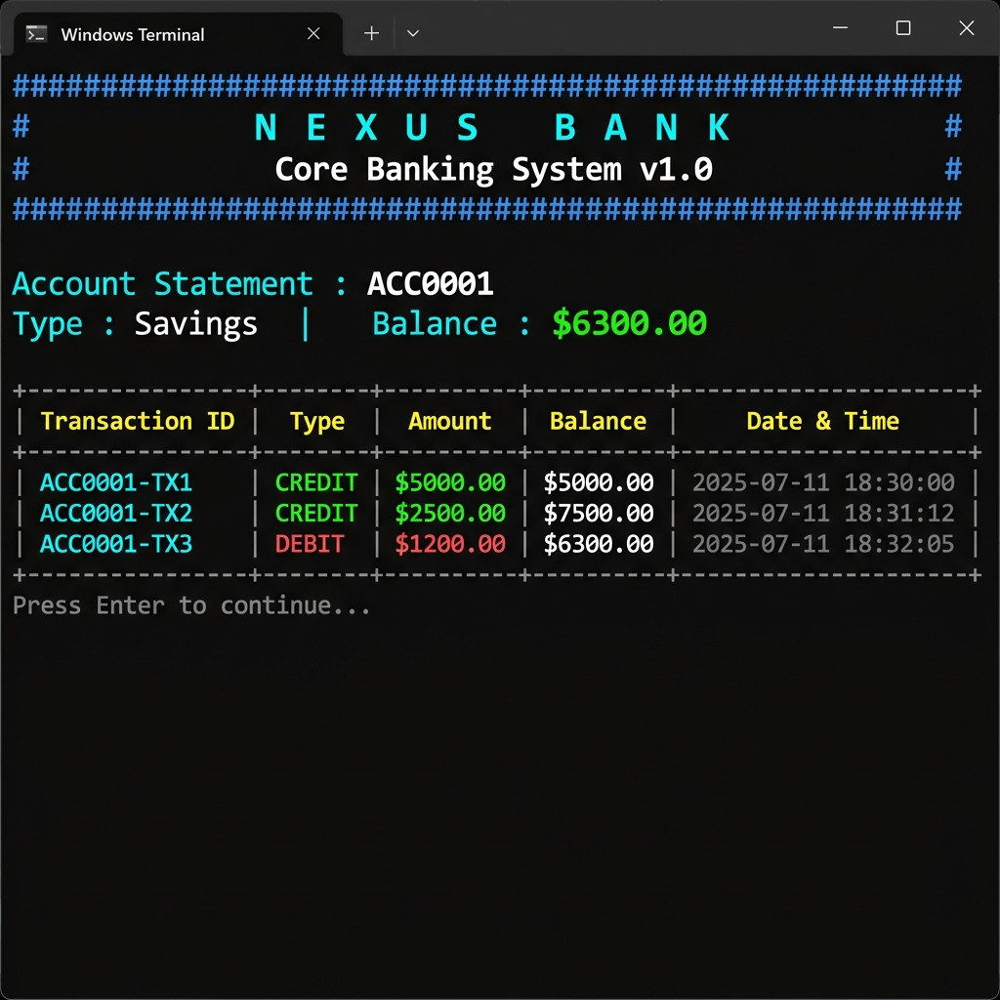

<div align="center">

# 🏦 Nexus Bank — Core Banking System

**A feature-complete, terminal-based banking application built in C++17**


</div>

---

## 📸 Screenshots

<table>
  <tr>
    <td align="center"><b>Main Menu</b></td>
    <td align="center"><b>Customer Registration</b></td>
  </tr>
  <tr>
    <td></td>
    <td></td>
  </tr>
  <tr>
    <td align="center"><b>Deposit Funds</b></td>
    <td align="center"><b>Transaction History</b></td>
  </tr>
  <tr>
    <td></td>
    <td></td>
  </tr>
</table>

---

## 📋 Overview

Nexus Bank is a fully functional core banking system implemented in **C++17**. It runs entirely in the terminal and uses **ANSI escape codes** for a rich, colorful interface. All data is persisted locally via file I/O — no database or third-party library required.

This project was built as **Task 4** of the [CodeAlpha](https://www.codealpha.tech/) C++ internship program.

---

## ✨ Features

| Feature | Details |
|---|---|
| 👤 Customer Management | Register customers with name, email, phone, and address |
| 🏦 Multiple Account Types | Savings, Checking, and Fixed Deposit accounts |
| 💰 Deposits | Credit funds to any account with instant confirmation |
| 💸 Withdrawals | Debit funds with insufficient-balance protection |
| 🔄 Fund Transfers | Move money between any two accounts atomically |
| 📋 Transaction History | Full statement view with type, amount, balance, and timestamp |
| 🗒️ Mini Statement | Quick view of the last 5 transactions |
| 👥 Customer Profile | View all accounts and personal details per customer |
| 💾 Persistent Storage | Data saved to flat files; reloaded automatically on launch |
| 🎨 Colorful UI | ANSI colors throughout — green for credits, red for debits |

---

## 🏛️ Class Architecture

```
┌─────────────────────────────────────────────────────────────────┐
│                          Bank (Controller)                      │
│  - manages customers map  - manages accounts map                │
│  - menu navigation        - file I/O (save / load)              │
└───────────────────┬───────────────┬─────────────────────────────┘
                    │               │
         ┌──────────▼──────┐  ┌────▼────────────────┐
         │    Customer      │  │       Account        │
         │──────────────── │  │─────────────────────│
         │ customerID      │  │ accountNumber        │
         │ fullName        │  │ customerID           │
         │ email, phone    │  │ accountType          │
         │ address         │  │ balance              │
         │ dateJoined      │  │ transactionCounter   │
         │ accountNumbers[]│  │ transactions[]       │
         └─────────────────┘  └──────────┬───────────┘
                                         │
                               ┌─────────▼──────────┐
                               │     Transaction     │
                               │────────────────────│
                               │ transactionID       │
                               │ type (CREDIT/DEBIT) │
                               │ amount              │
                               │ balanceAfter        │
                               │ timestamp           │
                               │ serialize()         │
                               └─────────────────────┘
```

---

## 🚀 Build & Run

### Option 1 — Download & Run (Windows, no compiler needed)

Just download `banking_system.exe` from this repo and double-click it, or run in CMD:

```cmd
banking_system.exe
```

### Option 2 — Build from Source

**Windows (MinGW / MSYS2)**
```cmd
g++ -std=c++17 -O2 -o banking_system.exe banking_system.cpp
banking_system.exe
```

**Or just double-click `build_and_run.bat`**

**Linux / macOS**
```bash
g++ -std=c++17 -O2 -o banking_system banking_system.cpp
./banking_system
```

> Requires GCC 7+ or any C++17-compliant compiler.

---

## 🗂️ Project Structure

```
CodeAlpha_Banking-System/
├── banking_system.cpp      # Full source — all classes and logic
├── banking_system.exe      # Prebuilt Windows executable
├── build_and_run.bat       # One-click build script (Windows)
├── assets/
│   ├── main_menu.png
│   ├── customer_registration.png
│   ├── deposit.png
│   └── transactions.png
├── data/                   # Auto-created at runtime
│   ├── customers.dat
│   ├── accounts.dat
│   └── meta.dat
└── README.md
```

---

## 🎮 Usage Guide

```
MAIN MENU
--------------------------------------------------------
1.  Register New Customer       → Enter personal details, get a Customer ID
2.  Open New Account            → Link Savings/Checking/FD to a customer
3.  Deposit                     → Credit funds, balance updates instantly
4.  Withdraw                    → Debit with insufficient-funds check
5.  Fund Transfer               → Move money between accounts
6.  View Account & Transactions → Full 10-transaction statement
7.  Mini Statement (Last 5)     → Quick recent activity view
8.  View Customer Profile       → See all accounts + balances per customer
9.  List All Customers          → Table of all registered customers
0.  Exit                        → Saves all data and exits
```

---

## 💾 Data Persistence

At runtime, the system creates a `data/` folder containing:

| File | Contents |
|---|---|
| `customers.dat` | Pipe-delimited customer records |
| `accounts.dat` | Account records + embedded transaction log |
| `meta.dat` | Auto-increment counters for IDs |

Data is written on every operation and reloaded on the next launch. No external database is required.

---

## 🛠️ Technical Details

- **Language**: C++17
- **Compiler**: g++ (MinGW-w64 / GCC)
- **Colors**: ANSI escape codes via `SetConsoleMode(ENABLE_VIRTUAL_TERMINAL_PROCESSING)` on Windows
- **Storage**: Plain-text flat-file I/O with `|`-delimited fields
- **Data Structures**: `std::map` for O(log n) customer/account lookup, `std::vector` for transaction logs
- **No dependencies**: Standard Library only — `<iostream>`, `<fstream>`, `<map>`, `<vector>`, `<ctime>`

---

## 👨‍💻 Author

**Aryan** — CodeAlpha C++ Internship, Task 4

[](https://github.com/dat1aryan)
